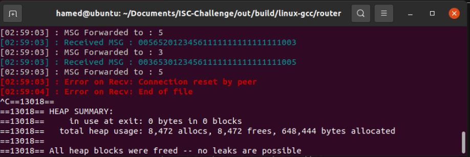
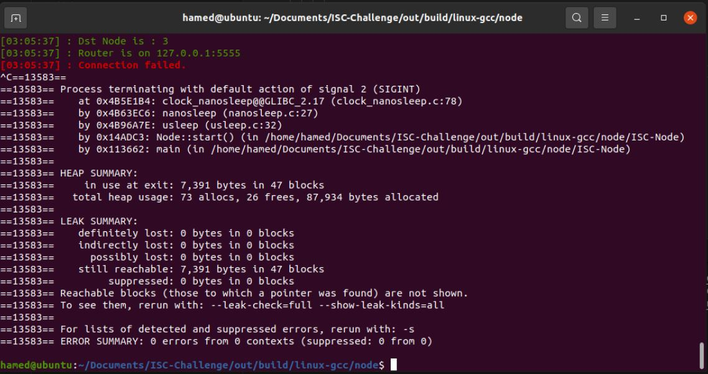
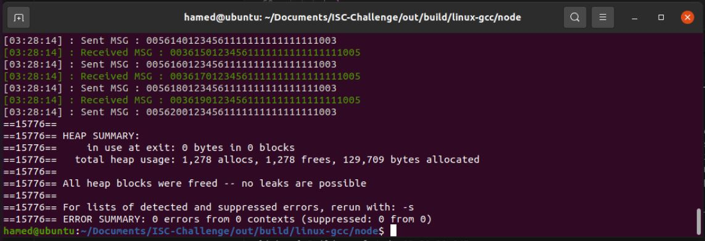

# ISC Programming Challenge: Message Routing System

  

  

## System Components

  

  

-  **Member**

  

- Unique ID (1-999).

  

- Connects to the router via TCP.

  

-  **Router**

  

- Routes messages between members.

  

- Logs all sent/received messages in a file.

  

-  **Message**

  

- Fixed 32-character format:

  

`ID (3) | MTI (4) | Trace (6) | PAN (16) | Dest.ID (3)`

  

- Example Request (Member 5 → 3):

  

`00522001234561111111111111111003`

  

- Example Reply (Member 3 → 5):

  

`00322101234561111111111111111005`

  

  

## Implementation Steps

  

  

1.  **Setup**

  

- Implement members and router.

  

- Members connect to the router and register their IDs via TCP.

  

2.  **Message Routing**

  

- Members generate messages in the specified format.

  

- Router forwards messages to the `Dest.ID`.

  

3.  **Reply Handling**

  

- Destination member increments the `MTI` by 10 (e.g., `2200` → `2210`).

  

- Reply is sent back to the source member via the router.

  

4.  **Logging**

  

- Router logs all messages in a file.

  

  

## Requirements

  

  

- Use **CMake** for project generation.

  

- Code in **Modern C++ (11/14/17)**.

  

- External libraries are allowed.

  

  

## Solution

  

The system solution prioritizes _performance at the router_ and _simplicity at the endpoints_.

  

  

### Router Design

  

In the context of router design, we aim to efficiently manage up to 999 concurrent connections while minimizing resource overhead. To achieve this goal, I propose employing the Proactor Pattern in conjunction with Boost.Asio, utilizing a single `io_context` paired with a thread pool consisting of 4 to 8 workers.

  

  

This event-driven model offers several advantages:

  

  

1.  **Resource Efficiency**: By avoiding the need for a large number of idle threads, we can significantly reduce resource overhead. This is particularly beneficial in environments where system resources are constrained.

  

2.  **Scalability**: The architecture can easily scale to accommodate increased traffic or additional connections without a complete redesign.

  

3.  **Minimal Logic**: The Proactor Pattern is well-suited for handling simple operations asynchronously, allowing the router to process a large number of connections efficiently.

  

  

However, there are some trade-offs to consider:

  

  

-  **Increased Complexity**: Implementing an event-driven model can complicate the codebase. Developers must be diligent in managing state and handling asynchronous events, which can lead to challenges in debugging and maintaining the system.

  

-  **Debugging Difficulties**: The asynchronous nature of the Proactor Pattern can make it more challenging to trace the flow of execution and diagnose issues, necessitating effective logging and monitoring strategies.

  

  

In designing a router, it is reasonable to prioritize performance over simplicity, particularly when dealing with a high volume of concurrent connections.

  

  

### Node Design

  

In the Node, we utilize a single-threaded request-response model. The process logic is straightforward and lightweight (involving just one addition), resulting in low CPU usage and high agility. Due to this simplicity, I've chosen to maintain a single-threaded approach (primarily due to time constraints :D), which led me to disregard the use of sending and receiving queues. I believe that a blocking TCP socket with one thread per member is adequate for keeping the node structure uncomplicated. Furthermore, I haven't identified any benefits of a non-blocking mechanism compared to a blocking one. If the node isn't receiving any messages and bypasses the `recv` method, it has no tasks to perform. Consequently, non-blocking adds unnecessary complexity to the code logic.

  

  

### Node-Router Messaging

  

In a microservices environment, it is common to utilize inter-process communication (IPC) mechanisms such as gRPC and various serialization routines. However, the fixed message size and straightforward format of raw sockets often lead me to bypass these methods in favor of using direct memory access and simple socket communication. This choice can help avoid the overhead associated with gRPC and serialization, thereby enhancing performance and reducing latency for services that require quick and lightweight communication.

  

### Detail information about the Router design

The question states that **999** clients will be exist at maximum, which implicitly hint us that we can utilize the `select()` function for I/O multiplexing (as it can handle up to 1023 clients).

The advantage of `select()` is its cross-platform, and it is eliminating the need for additional libraries. However, its performance can be a concern; it operates with a time complexity of O(N) because it must traverse the entire file descriptor array to identify which descriptors are ready for I/O.

Additionally, `select()` requires copying the entire file descriptor set from user space to kernel space each time it is invoked, leading to some overhead.

Overally, this function is well-suited for smaller programs and applications that do not require high performance or extensive connection handling.

A more efficient approach is to utilize the `epoll()` function, which operates on an event-driven model. This means that `epoll()` does not continuously scan the file descriptor set to identify which descriptors are ready, resulting in a time complexity of O(1). However, it's worth noting that `epoll()` is not cross-platform and is specific to Linux.

The `epoll()` function also adheres to the **Reactor pattern**, which signals when an I/O operation is ready (for instance, when data is available for reading). Alternatively, the **Proactor pattern** can be employed, which notifies when an I/O operation has been completed (for example, when data has been successfully read into a buffer).

The Proactor pattern is often preferable because, in the Reactor model, the application itself is responsible for managing partial I/O buffering (collecting data until a complete message is received). In contrast, the Proactor model allows the operating system to handle these partial messages and deliver them only once they are complete.

If we want to implement an **event-driven** model using the **Proactor pattern** in a **cross-platform** manner, the **Boost.Asio** library provides a suitable solution, allowing us to avoid reinventing the wheel.

According to the question and the hidden guidance provided (maximum 999 clients), I should use the `select()` method, but when there is a ready library for a more efficient method, I decided to do the better method(and pre-provided) and use Boost.Asio library.

you can find more information about `select()`and `epoll()` [here.](https://notes.shichao.io/unp/ch6/)


## Supported Platforms

  

-  **Windows** - successfully built, run, and tested.

  

-  **Linux** - successfully built, run, and tested.

  

  

## Build Routine for CMake Project

  

### Build Steps

  

  

#### 1. Clone the Repository

  

This project includes `spdlog` as a Git submodule, so it is necessary to clone the repository recursively to include the `spdlog` repository as well. Use the following command:

  

  

```bash

git  clone  --recurse-submodules  https://github.com/hamed65kz/ISC-Challenge.git

```

  

  

#### 2. VCPKG Setup

  

This project utilizes [vcpkg](https://github.com/microsoft/vcpkg) for managing external libraries. Specifically, we require `Boost.Asio` for asynchronous network operations and `gtest` for unit testing.

  

  

Fortunately, you do not need to install vcpkg and its dependencies manually. The project includes an automated routine that installs vcpkg and subsequently installs the dependencies listed in the `Dependencies.txt` file located in the root of the project. This routine will be triggered when you start configuring the CMake project.


:warning:The key point is that on Windows, the default triplet is x64-windows, which utilizes the MSVC compiler. Consequently, packages are built using MSVC. If you switch the CMake generator to MinGW, the installed packages will not be compatible with MinGW, Since MSVC and MinGW utilize different C++ ABIs and link to separate runtime libraries, combining them can lead to linker errors like LNK2019 or undefined references. Unfortunately, the current VCPKG automated process does not account for compiler-specific triplets and only installs the platform-specific default triplet. Therefore, on Windows, you cannot link packages built with MSVC to executables built with MinGW.

  

#### 3. Build the Project

```bash

cmake  -S  .  -B  out

cd  out

cmake  --build  .  --config  Release

```


During the CMake configuration process, the vcpkg installer script will run in a separate console, pausing cmake until it finishes. This script will set up vcpkg and install the external packages specified in the Dependencies.txt file. After the installation is complete, the user should close the console to allow the CMake process to proceed with its configurations.

## How to Run

  

### Running the Router Executable

  

To run the router executable, use the following command:

  

```bash

ISC-Router.exe <listen_port>

```

  

For example, to run the router on port 6060:

  

```bash

ISC-Router.exe  6060

```

  

### Running the Node Executable

  

To run the node executable, use the following command:

  

```bash

ISC-Node.exe <id> <dstid> <router_ip> <router_port>

```

 For example, to run a node with ID 3 that communicates with destination ID 5 through the router at IP address 127.0.0.1 on port 6060, use:
 

```bash

ISC-Node.exe  3  5  "127.0.0.1"  6060

```

a sample running example is like:

```bash

ISC-Router.exe  6060

ISC-Node.exe  5  3  "127.0.0.1"  6060

ISC-Node.exe  3  5  "127.0.0.1"  6060

```

### Important Note
All nodes will send a message to destination node on node startup.

  
## Memory Profiling
I use Valgrind to detect memory-related problems. I run it for both the Router and Node, and the results are displayed below.

### The Router
I ran Valgrind on the Router, and it didn't report any memory issues, indicating that all memory blocks were successfully freed.


### The Node
I ran Valgrind on the Node application and suddenly terminated its execution, which resulted in reports of some memory blocks that were not freed. Upon reviewing the code, I found that these memory blocks were allocated internally within the constructors of the Node and TCPSocket classes. This internal memory is supposed to be released in their respective destructors. However, in the Node, there is an infinite while loop that prevents objects from going out of scope, which means the destructors are never called.

To confirm that all the unreleased memory was associated with the internal allocations of these two classes, I altered the code to add a round limit. This modification enabled the execution to eventually break out of the while loop and invoke the destructors. After making this change, I ran Valgrind once more, and it indicated that there were no memory leaks.
Keeping only internal memories and nothing else implies that memory will not growth over time.


below screen shows Valgrind output for the Node before editing the infinite loop and dont call objects destructors:




below screen shows Valgrind output for the Node after editing the loop, allowing destructors to be invoked and internal memory to be released:



## Demonstration
  This program does amazing things. Below is a demonstration of its execution:


## Future Works
A. The node should incorporate receive and send queues to manage bursts of traffic effectively.
B. Performance and CPU profiling, measure message throughput.